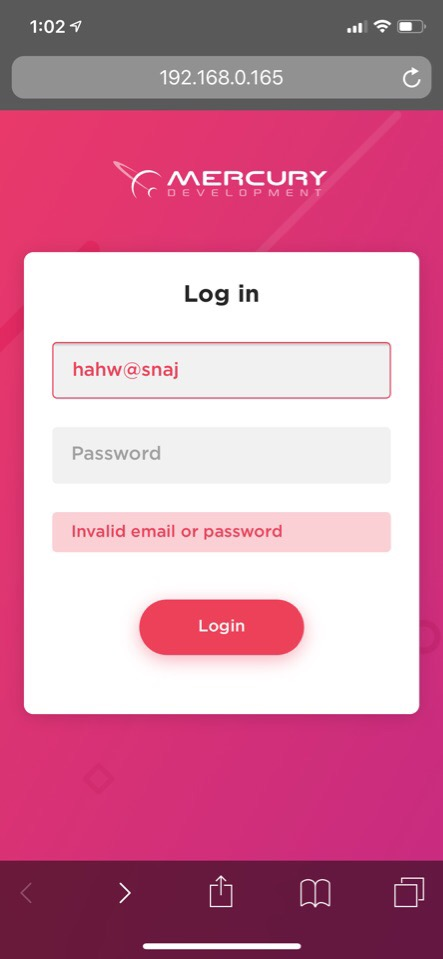
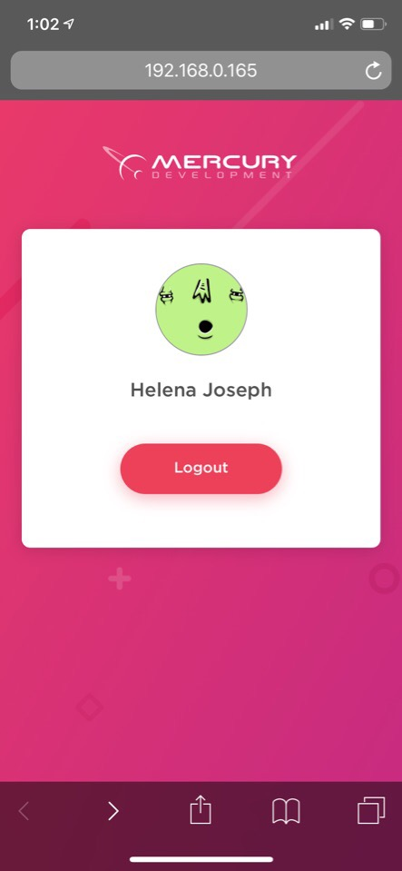

# Mercury Academy Test Task 
  
Page with user authorization form.  
The request will be successful for the account *user@example.com / mercdev*.  

### Getting Started
These instructions will get you a copy of the project up and running on your local machine.
1. Clone the project
```
git clone https://github.com/androsovatati/mercury-academy.git
```
2.  Install the package using npm or yarn
```
npm i -g serve
yarn global add serve
```
3. Finally, run this command inside project's directory to see a project on http://localhost:5000/
```
serve ./build
```

### Preview

Desktop version


Mobile version

Start page | Invalid data | Valid data | Successful authorization
:-------------------------:|:-------------------------:|:-------------------------:|:-------------------------:
 |  |  | 
